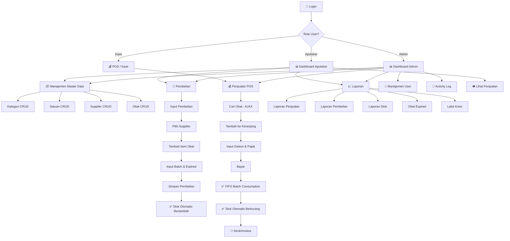
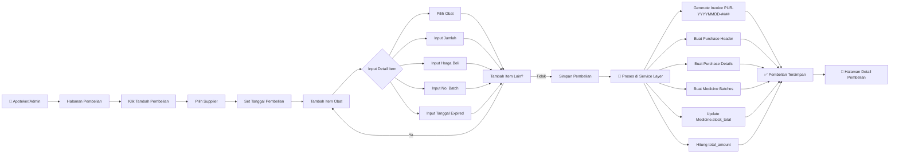
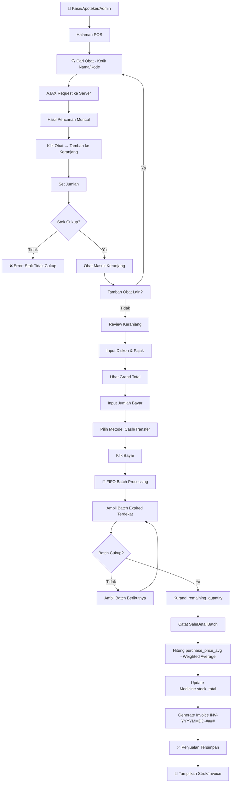
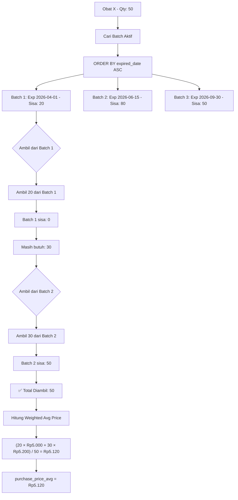
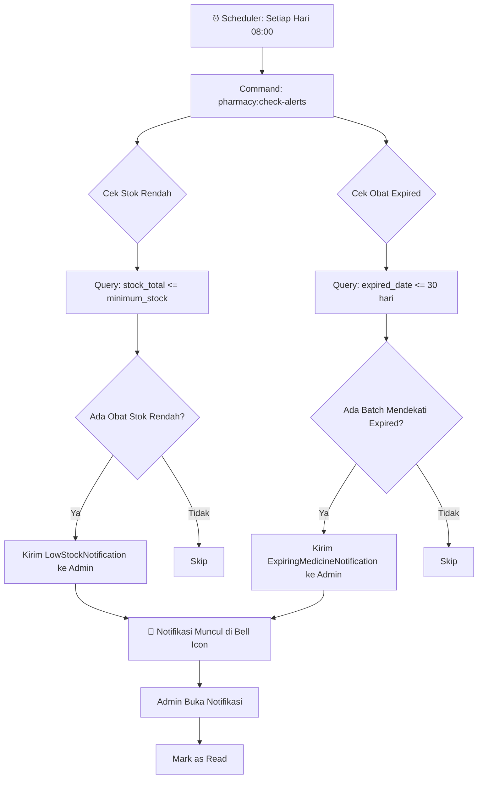
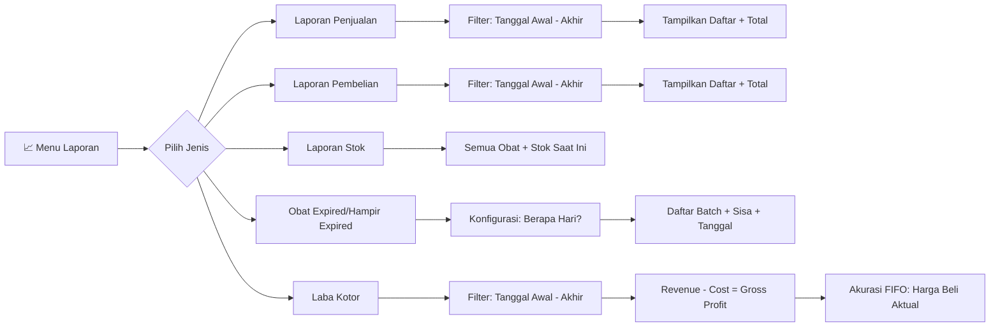
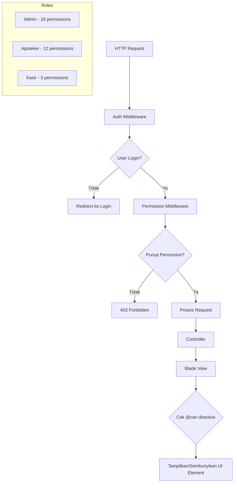
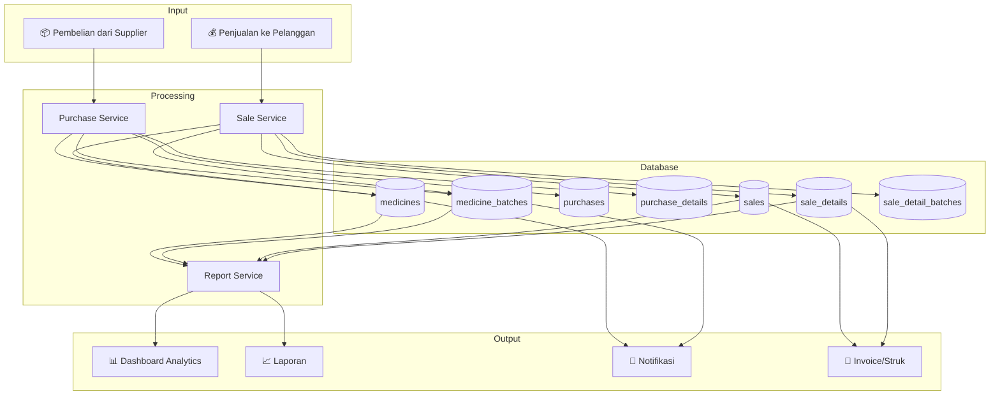

# 🔄 Business Flow Diagram — Apotek Kita Sehat

## 1. Alur Bisnis Utama (Main Business Flow)

---

## 2. Alur Pembelian (Purchase Flow)

---

## 3. Alur Penjualan POS (Sales/POS Flow)

---

## 4. Alur FIFO Batch Consumption

---

## 5. Alur Notifikasi & Alert

---

## 6. Alur Laporan (Reporting Flow)

---

## 7. Alur RBAC (Role-Based Access Control)

---

## 8. Alur Data Keseluruhan (Data Flow Overview)

