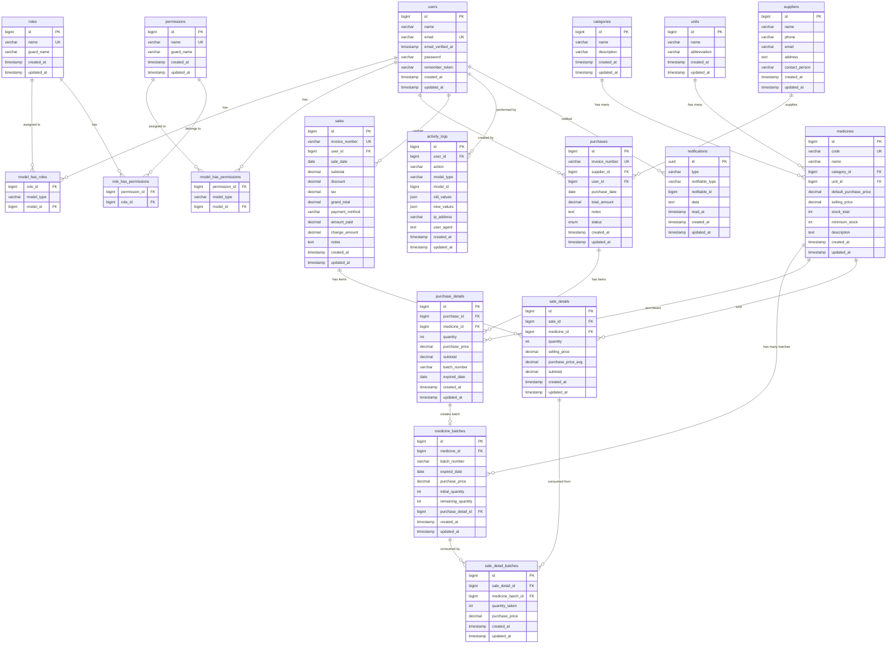

# 🗃 Entity Relationship Diagram (ERD)

## Diagram ERD — Apotek Kita Sehat



---

## 📝 Penjelasan Relasi

### 1. Users & RBAC
- Setiap **User** memiliki satu atau lebih **Role** (Admin, Apoteker, Kasir)
- Setiap **Role** memiliki banyak **Permission**
- Menggunakan Spatie `laravel-permission` (polymorphic many-to-many)

### 2. Master Data
- **Category** → many **Medicine** (Analgesik, Antibiotik, dll)
- **Unit** → many **Medicine** (Tablet, Kapsul, Botol, dll)
- **Supplier** → many **Purchase** (PT Kimia Farma, dll)

### 3. Medicine & Batch Tracking
- Setiap **Medicine** memiliki banyak **MedicineBatch**
- Setiap batch mencatat: nomor batch, tanggal expired, harga beli, qty awal, qty tersisa
- `stock_total` pada Medicine = SUM(`remaining_quantity`) dari semua batch aktif

### 4. Purchase Flow
```
Purchase (header)
  └── PurchaseDetail (item)
        └── MedicineBatch (stok baru) → Medicine.stock_total naik
```

### 5. Sale Flow (FIFO)
```
Sale (header)
  └── SaleDetail (item)
        └── SaleDetailBatch (tracking FIFO)
              └── MedicineBatch.remaining_quantity turun
                    └── Medicine.stock_total turun
```

### 6. FIFO Logic
- Saat penjualan, sistem mengambil stok dari batch dengan `expired_date` **paling awal** (First Expired First Out)
- Jika satu batch tidak cukup, lanjut ke batch berikutnya
- `purchase_price_avg` dihitung dari weighted average harga beli batch yang dikonsumsi

---

## 📊 Statistik Database

| Tabel | Kolom | Deskripsi |
|-------|-------|-----------|
| users | 7 | Data karyawan/user |
| categories | 4 | Kategori obat |
| units | 4 | Satuan obat |
| medicines | 11 | Master obat |
| medicine_batches | 9 | Batch/lot per obat |
| suppliers | 7 | Data supplier |
| purchases | 9 | Header pembelian |
| purchase_details | 8 | Detail pembelian |
| sales | 12 | Header penjualan |
| sale_details | 7 | Detail penjualan |
| sale_detail_batches | 5 | Tracking FIFO |
| activity_logs | 10 | Audit trail |
| notifications | 7 | Notifikasi sistem |
| **Total** | **~100** | **13 tabel utama** |
